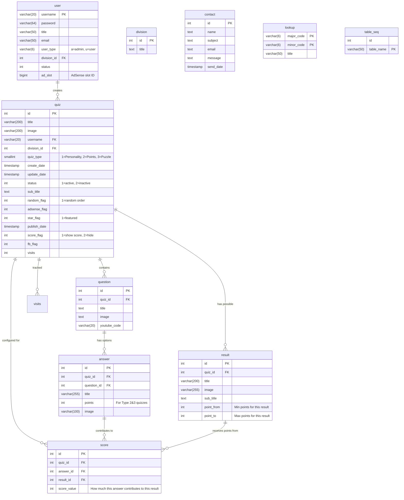

# FaceQuizz Legacy System Analysis - Quiz Types and Result Calculation

## Overview

The FaceQuizz application is a quiz platform that supports multiple quiz types with different scoring mechanisms. Based on the legacy PHP codebase analysis, here's how the system works.

## Database Schema Overview

### Core Tables
- **quiz**: Main quiz configuration
- **question**: Questions belonging to a quiz
- **answer**: Answer options for questions
- **result**: Possible quiz results/outcomes
- **score**: Association between answers and results with scoring values
- **user**: Quiz creators and administrators

## Database Diagram



## Detailed Table Descriptions

### Primary Tables

#### `user` Table
- **Purpose**: Stores quiz creators and administrators
- **Key Fields**:
  - `username`: Primary key, unique identifier
  - `user_type`: 'a' for admin, 'u' for regular user
  - `ad_slot`: AdSense slot ID for revenue sharing
  - `division_id`: User's category/division

#### `quiz` Table  
- **Purpose**: Main quiz configuration and metadata
- **Key Fields**:
  - `quiz_type`: Determines scoring algorithm (1=Personality, 2=Points, 3=Puzzle)
  - `status`: Publication status (1=published, 2=draft)
  - `random_flag`: Whether to randomize question/answer order
  - `score_flag`: Whether to display numeric scores to users
  - `star_flag`: Featured quiz indicator
  - `visits`: Cached visit count for performance

#### `question` Table
- **Purpose**: Individual questions within quizzes
- **Key Fields**:
  - `title`: Question text
  - `image`: Optional question image path
  - `youtube_code`: Optional YouTube video ID for embedded videos

#### `answer` Table
- **Purpose**: Answer options for questions
- **Key Fields**:
  - `title`: Answer text displayed to user
  - `points`: Point value for Type 2&3 quizzes (0 for incorrect, positive for correct)
  - `quiz_id`: Denormalized for query performance

#### `result` Table
- **Purpose**: Possible quiz outcomes/results
- **Key Fields**:
  - `title`: Result title shown to user
  - `sub_title`: Detailed result description
  - `image`: Result image for sharing
  - `point_from/point_to`: Point range for Type 2&3 quizzes

#### `score` Table
- **Purpose**: Associates answers with results for Type 1 (Personality) quizzes
- **Key Fields**:
  - `score_value`: How much selecting this answer contributes to this result
  - **Unique constraint**: `(answer_id, result_id)` - each answer can only have one score per result

### Supporting Tables

#### `division` Table
- **Purpose**: Categories/divisions for organizing quizzes and users

#### `contact` Table  
- **Purpose**: Contact form submissions from users

#### `lookup` Table
- **Purpose**: System lookup values and constants
- **Structure**: Hierarchical with major_code and minor_code

#### `table_seq` Table
- **Purpose**: Manual sequence management for auto-increment IDs

## Database Triggers

The system uses several MySQL triggers for data consistency:

1. **`answer_after_insert`**: Auto-creates score records when new answers are added
2. **`result_after_insert`**: Auto-creates score records when new results are added  
3. **`quiz_after_update`**: Updates timestamps and publish dates
4. **Sequence triggers**: Maintain manual sequence counters

## Key Relationships

1. **One-to-Many**: `quiz → question → answer`
2. **Many-to-Many**: `answer ↔ result` (via `score` table)
3. **Denormalization**: `quiz_id` stored in `answer` table for performance
4. **Cascade Deletes**: Removing questions deletes associated answers and scores

## Quiz Types

The system supports 3 main quiz types based on the `quiz_type` field:

### 1. Personality Quiz (Type 1)
- **Purpose**: Determines personality traits or characteristics
- **Scoring Method**: Score-based mapping where different answers contribute different values to different result categories
- **Example**: "What's your personality type?" or "Which character are you?"

### 2. Points/Knowledge Quiz (Type 2)
- **Purpose**: Tests knowledge with point-based scoring
- **Scoring Method**: Each answer has a point value, total points determine the result range
- **Example**: "Test your knowledge" or "How much do you know about..."

### 3. Puzzle Quiz (Type 3)
- **Purpose**: Single-question puzzle with immediate right/wrong feedback
- **Scoring Method**: Binary scoring - 1 point for correct answer, 0 for incorrect
- **Structure**: Always exactly one question with multiple answer options
- **Results**: Always exactly 2 results:
  - Result 1: "Your answer is correct" (point_from=1, point_to=1)
  - Result 2: "Your answer is wrong, the correct answer is [correct_answer]" (point_from=0, point_to=0)
- **Example**: "How many people are in this picture?", "What's the next number in the sequence?", "Spot the difference"

## Result Calculation Logic

### For Personality Quizzes (Type 1)

```sql
-- From Id_Model::getresult() method
SELECT score.result_id, sum(score_value), result.title, result.sub_title, result.id 
FROM answer, score, result
WHERE answer.id IN (selected_answer_ids) 
AND score.answer_id = answer.id
AND result.id = score.result_id
GROUP BY score.result_id
ORDER BY sum(score_value) DESC 
LIMIT 1
```

**How it works:**
1. Each answer option can contribute different score values to different possible results
2. When user completes quiz, sum up all score contributions for each possible result
3. The result with the highest total score wins
4. This allows complex personality mapping where answers influence multiple traits

**Example:**
- Question: "What's your ideal weekend?"
- Answer A: "Reading a book" → Contributes +3 to "Introvert" result, +1 to "Intellectual" result
- Answer B: "Partying with friends" → Contributes +3 to "Extrovert" result, +1 to "Social" result

### For Points/Knowledge Quizzes (Type 2) & Puzzle Quizzes (Type 3)

```sql
-- From Id_Model::getresult() method  
SELECT result.id, result.point_from, result.point_to, sum(points) as score
FROM answer, question, result 
WHERE answer.id IN (selected_answer_ids)  
AND answer.question_id = question.id
AND result.quiz_id = question.quiz_id
GROUP BY result.id
HAVING sum(points) BETWEEN point_from AND point_to
LIMIT 1
```

**How it works for Type 2 (Knowledge Quiz):**
1. Each answer has a `points` value (correct answers typically have points > 0)
2. Sum all points from selected answers
3. Find the result range where total points fall between `point_from` and `point_to`
4. Return the matching result

**Example for Type 2:**
- Total possible points: 20
- Result ranges:
  - 0-5 points: "Beginner" 
  - 6-12 points: "Intermediate"
  - 13-20 points: "Expert"

**How it works for Type 3 (Puzzle Quiz):**
1. Single question with multiple answer options
2. Only one answer has `points = 1` (the correct answer)
3. All other answers have `points = 0` (incorrect answers)
4. Two predefined results:
   - Result 1: `point_from = 1, point_to = 1` → "Your answer is correct!"
   - Result 2: `point_from = 0, point_to = 0` → "Your answer is wrong, the correct answer is [correct_answer_text]"
5. User gets Result 1 if they selected the correct answer (1 point), Result 2 if incorrect (0 points)

**Example for Type 3:**
- Question: "How many people are in this picture?"
- Answers:
  - A: "3 people" (points = 0)
  - B: "4 people" (points = 1) ← Correct answer
  - C: "5 people" (points = 0)
  - D: "6 people" (points = 0)
- Results:
  - "Correct! You found all 4 people in the picture." (point_from=1, point_to=1)
  - "Wrong answer! The correct answer is 4 people. Look more carefully at the shadows and reflections." (point_from=0, point_to=0)

## Quiz Configuration Options

### Core Settings
- **title**: Quiz main title
- **sub_title**: Quiz description
- **quiz_type**: 1=Personality, 2=Points, 3=Puzzle
- **status**: 1=Active, 2=Inactive
- **random_flag**: 1=Randomize questions/answers, 0=Fixed order
- **score_flag**: Controls score display behavior
  - **0**: Hide numeric score completely
  - **1**: Show numeric score as "X من Y" (X out of Y points)
  - **2**: Default/legacy value (typically hides score)
- **star_flag**: Featured quiz flag
- **division_id**: Category/division (typically 1)

### Score Display Logic

The system calculates and displays scores differently based on `score_flag` and quiz type:

#### Score Calculation
```php
// After quiz submission
$result = getresult($selected_answers, $quiz_type);
$user_score = $result['score'];

// Calculate max possible points for the quiz
$max_point = "(select max(point_to) from result where quiz_id = :id)";

// Create score description
$result_desc = $user_score . ' من ' . $max_point; // "X out of Y" in Arabic
```

#### Score Display on Result Page
```php
// Only show numeric score if score_flag is enabled
if (isset($_COOKIE['resultdesc_' . $quiz_id]) && $score_flag == "1") {
    echo $_COOKIE['resultdesc_' . $quiz_id]; // Shows: "15 من 20"
}
```

#### Score Flag Behavior by Quiz Type

**Type 1 (Personality Quiz)**:
- **score_flag = 0**: Only shows personality result (e.g., "You are an Introvert")
- **score_flag = 1**: Shows result + score breakdown (rare, since personality quizzes don't typically show numeric scores)

**Type 2 (Knowledge Quiz)**:
- **score_flag = 0**: Only shows achievement level (e.g., "Expert Level")
- **score_flag = 1**: Shows achievement + numeric score (e.g., "Expert Level - 18 من 20")

**Type 3 (Puzzle Quiz)**:
- **score_flag = 0**: Only shows correct/incorrect message
- **score_flag = 1**: Shows result + "1 من 1" for correct or "0 من 1" for incorrect

#### Max Point Calculation

The `max_point` is calculated dynamically using:
```sql
SELECT max(point_to) FROM result WHERE quiz_id = :quiz_id
```

This ensures the maximum possible score is always accurate, even if result ranges are modified.

**Examples**:
- **Type 2 Quiz** with results: Beginner (0-5), Intermediate (6-12), Expert (13-20) → `max_point = 20`
- **Type 3 Quiz** with results: Correct (1-1), Incorrect (0-0) → `max_point = 1`

### Question Configuration
- **title**: Question text
- **image**: Optional question image
- **youtube_code**: Optional YouTube video embed

### Answer Configuration
- **title**: Answer text
- **points**: Point value (for Type 2&3 quizzes)
- **image**: Optional answer image

### Result Configuration
- **title**: Result title
- **sub_title**: Result description
- **image**: Result image
- **point_from/point_to**: Point range (for Type 2&3 quizzes)
  - **Type 2**: Variable ranges (e.g., 0-5, 6-12, 13-20)
  - **Type 3**: Always two results - (1,1) for correct, (0,0) for incorrect

## Score Association System (Type 1 Only)

The `score` table creates associations between:
- **answer_id**: Specific answer option
- **result_id**: Possible quiz result  
- **score_value**: How much this answer contributes to this result

This allows sophisticated personality quiz logic where:
- One answer can influence multiple personality traits
- Different answers can contribute varying amounts to the same trait
- Results are determined by cumulative scoring across all questions

## Quiz Flow with Score Handling

### Quiz Submission Process
```php
// 1. User submits quiz form with selected answers
if (!empty($_POST)) {
    $keys = array_values($_POST);           // Get selected answer IDs
    $query = join(",", $keys);              // Create comma-separated list
    
    // 2. Calculate result based on quiz type
    $resultget = $this->model->getresult($query, $quiz['quiz_type']);
    $user_score = $resultget[0]['score'];
    
    // 3. Create score description for display
    $result_desc = $user_score . ' من ' . $quiz['max_point'];
    
    // 4. Store score in cookie for result page
    setcookie('resultdesc_' . $quiz['quiz_id'], $result_desc, time()+600, "/", "facequizz.com");
    
    // 5. Redirect to result page
    header('Location: ' . quizLink(['quiz_id' => $quiz['quiz_id']]) . '&r=' . $resultget[0]['id'] . '&sr=1');
}
```

### Result Page Display
```php
// Result page shows title and conditionally shows score
echo '<h1>' . $result['title'];

// Only show numeric score if score_flag is enabled
if (isset($_COOKIE['resultdesc_' . $quiz_id]) && $score_flag == "1") {
    echo '<strong>' . $_COOKIE['resultdesc_' . $quiz_id] . '</strong>';
}

echo '</h1>';
```

### Score Storage & Persistence
- **Temporary Storage**: Score stored in browser cookie for 10 minutes (600 seconds)
- **Cookie Name**: `resultdesc_{quiz_id}` 
- **Cookie Value**: "{user_score} من {max_point}" (Arabic: "X out of Y")
- **Purpose**: Allows score to persist during result sharing and page refreshes

### Real-world Examples

#### Type 2 Knowledge Quiz with score_flag=1
```
Quiz: "Geography Test" (20 total points)
User Score: 15 points
Result Title: "Geography Expert"
Display: "Geography Expert - 15 من 20"
```

#### Type 3 Puzzle Quiz with score_flag=1
```
Quiz: "Count the Cats" (1 total point)
User Score: 1 point (correct answer)
Result Title: "Correct! Amazing observation skills!"
Display: "Correct! Amazing observation skills! - 1 من 1"
```

#### Type 1 Personality Quiz with score_flag=0
```
Quiz: "What's Your Personality Type?"
Result Title: "You are an Introvert"
Display: "You are an Introvert" (no score shown)
```

### Taking a Quiz
1. User starts quiz (`/id/{quiz_id}`)
2. Questions presented one by one (controlled by JavaScript)
3. User selects answers for each question
4. Form submission sends all selected answer IDs via POST
5. Backend calculates result and user score based on quiz type
6. Score description created as "{score} من {max_point}" and stored in cookie
7. User redirected to result page with result ID
8. Result page shows outcome and conditionally displays score based on `score_flag`
9. Score persists in cookie for 10 minutes for sharing/refreshing

### Quiz Creation (Admin)
1. Create quiz with basic info
2. Add questions with answer options
3. For Type 1: Configure score associations between answers and results
4. For Type 2&3: Set point values for answers and point ranges for results
5. Publish quiz when ready

## Quiz Configuration Examples

### Type 1 - Personality Quiz
```json
{
  "quiz": {
    "title": "What's Your Learning Style?",
    "quiz_type": 1,
    "score_flag": 0
  },
  "questions": [
    {
      "title": "How do you prefer to learn new information?",
      "answers": [
        {"title": "Reading books and articles", "points": 0},
        {"title": "Watching videos", "points": 0},
        {"title": "Hands-on practice", "points": 0}
      ]
    }
  ],
  "results": [
    {"title": "Visual Learner", "point_from": 0, "point_to": 0},
    {"title": "Auditory Learner", "point_from": 0, "point_to": 0},
    {"title": "Kinesthetic Learner", "point_from": 0, "point_to": 0}
  ],
  "scores": [
    {"answer_id": 1, "result_id": 1, "score_value": 3},
    {"answer_id": 2, "result_id": 2, "score_value": 3},
    {"answer_id": 3, "result_id": 3, "score_value": 3}
  ]
}
```

### Type 2 - Knowledge Quiz
```json
{
  "quiz": {
    "title": "Geography Knowledge Test",
    "quiz_type": 2,
    "score_flag": 1
  },
  "questions": [
    {
      "title": "What is the capital of France?",
      "answers": [
        {"title": "London", "points": 0},
        {"title": "Paris", "points": 1},
        {"title": "Berlin", "points": 0}
      ]
    },
    {
      "title": "Which is the largest ocean?",
      "answers": [
        {"title": "Atlantic", "points": 0},
        {"title": "Pacific", "points": 1},
        {"title": "Indian", "points": 0}
      ]
    }
  ],
  "results": [
    {"title": "Beginner", "point_from": 0, "point_to": 0},
    {"title": "Expert", "point_from": 1, "point_to": 2}
  ]
}
```

### Type 3 - Puzzle Quiz
```json
{
  "quiz": {
    "title": "Count the Hidden Objects",
    "quiz_type": 3,
    "score_flag": 0
  },
  "questions": [
    {
      "title": "How many cats are hidden in this picture?",
      "image": "puzzle_image.jpg",
      "answers": [
        {"title": "3 cats", "points": 0},
        {"title": "4 cats", "points": 0},
        {"title": "5 cats", "points": 1},
        {"title": "6 cats", "points": 0}
      ]
    }
  ],
  "results": [
    {
      "title": "Correct! Amazing observation skills!",
      "sub_title": "You found all 5 cats hidden in the picture. Well done!",
      "point_from": 1,
      "point_to": 1
    },
    {
      "title": "Wrong answer! The correct answer is 5 cats",
      "sub_title": "Look more carefully - there are cats hiding behind the curtains, under the table, and in the shadows. Try again!",
      "point_from": 0,
      "point_to": 0
    }
  ]
}
```

### Sharing & Social Integration
- Facebook sharing with custom result images
- Twitter integration
- Custom result URLs for sharing specific outcomes
- Facebook comments integration

### Analytics & Tracking
- Google Analytics integration
- Different tracking for quiz start, completion, sharing

### Admin Features
- User management with different permission levels
- Quiz CRUD operations
- Image upload for questions, answers, and results
- Bulk operations via API endpoints

This analysis should provide a solid foundation for understanding the legacy system and planning the Next.js migration.
